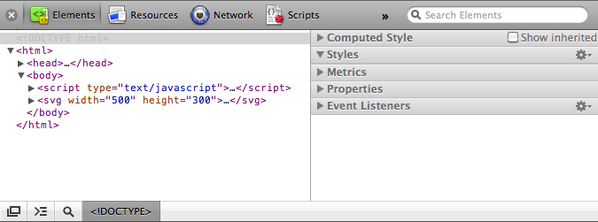

更新时间: 2012-12-30

使用D3前需要理解这些概念: HTML, DOM, CSS, JavaScript, SVG，还需要有必要的开发工具。

## HTML
HTML(超文本标记语言, HyperText Markup Language)用于结构化网页内容。最简单的HTML页面如下


<html>
<head>
	<title>Page Title</title>
</head>
<body>
	<h1>Page Title</h1>
	
This is a really interesting paragraph.

</body>
</html> 


## DOM
文档对象模型(Document Object Model, DOM)指的是HTML的分层结构。每个尖括号中的标签称为一个元素(element)，我们用人类术语来描述元素之间的相对关系: 父亲，儿子，兄弟，祖先，后代。在上面的HTML代码中，`body`是它里面的所有元素(`h1`和`p`)的父亲，而`h1`和`p`则互为兄弟。页面中所有的元素都是`html`的后代。

网页浏览器通过解析DOM来理解页面的内容。

## CSS
层叠样式表(Cascading Style Sheets, CSS)用于为HTML页面的图形表达设计样式。一个简单的CSS样式表如下


body {
    background-color: white;
    color: black;
}


CSS样式包括选择器(selectors)和规则(rules)。选择器指定应用样式的元素，下面是示例:

  - `h1`: 选择第1层标题
  - `p`:  选择段落
  - `.caption`: 选择`class`为`caption`的元素
  - `#subnav`: 选择`ID`为`subnav`的元素

规则是构成样式的内容，它是可累加的。示例如下:


color: pink;
background-color: yellow;
margin: 10px;
padding: 25px;


选择器和规则之间用大括号连接。


p {
    font-size: 12px;
    line-height: 14px;
    color: black;
}


D3使用CSS-样式选择器来定位需要操作的那些元素，因此理解CSS的使用很重要。

CSS的规则可以直接放在网页的`head`中，如


<head>
    
</head>


或单独存于后缀为`.css`的外部文件中，然后在网页的`head`中引用这个文件。

<head>
    <link rel="stylesheet" href="style.css">
</head>


## JavaScript
JavaScript是一种动态脚本语言，它可以向浏览器发送命令，在网页加载完成之后再去修改网页内容。

脚本可以直接放在HTML中的两个`script`标签之间。

<body>
    
</body>


它也可以存于外部文件中，然后在HTML的某个位置上引用(一般也是`head`)。


<head>
    <title>Page Title</title>
    
</head>


## 开发工具
熟悉浏览器的开发工具很重要。在一个基于WebKit的浏览器中(比如Safari或Chrome)，你可以打开"web inspector"，界面如下(Chrome中快捷键是Ctrl+Shift+I，也可以在Tools菜单中找到)。Firefox也有类似的工具。

浏览器的"View Source"显示的是原始HTML页面的源码，而"web inspector"则可以显示DOM的当前结构，也就是执行完JavaScript之后的网页内容。在web inspector中，你可以观察到元素的变化。你还可以使用JavaScript终端(console)来调试代码。参考[debugging HTML,CSS, and JavaScript with the web inspector and console](http://developer.apple.com/library/safari/documentation/appleapplications/Conceptual/Safari_Developer_Guide/DebuggingYourWebsite/DebuggingYourWebsite.html#//apple_ref/doc/uid/TP40007874-CH8-SW3)。

## SVG
D3最擅长于用可缩放矢量图形(Scalable Vector Graphics, SVG)来渲染可视化结果。SVG是一种基于文本的图像格式。意思是，你可以通过编写简单的标记式代码来设计一幅SVG图像，类似于用标签设计HTML。事实上，SVG代码可以直接用于HTML文档中。网页浏览器很久前就已经支持SVG格式了([IE除外](http://caniuse.com/#feat=svg))，但目前为止仍然不是很流行。

下面是我用SVG编写的一个圆。

<svg width="50" height="50">
    <circle cx="25" cy="25" r="22"
     fill="blue" stroke="gray" stroke-width="2"/>
</svg>


<svg width="50" height="50">
    <circle cx="25" cy="25" r="22"
     fill="blue" stroke="gray" stroke-width="2"/>
</svg>

你可以点右键尝试一下，它并不是图片哦。然后，缩放网页时你也可以发现它是平滑过渡的，因为它是货真价实的矢量图(而不是一般的栅格图)。

你并不是必须要在D3中使用SVG，但是，SVG提供的大量的可视化效果，常规HTML元素根本无法实现。

