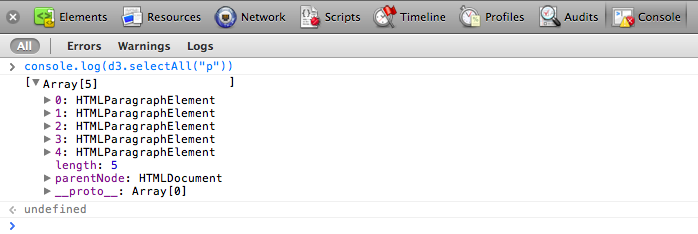

更新时间: 2012-12-30

------

绑定是啥意思? D3和我的数据有嘛关系?

数据可视化是一个将数据`映射`为图形的过程。即，输入数据，输出图形。比如，大数字对应于高的直方图，特殊类别得到更亮的颜色。映射规则取决于你。

通过D3，我们将输入数据`绑定`到DOM中的元素上。绑定好比将数据附着或联系到特定的元素上，然后你可以在应用映射规则的时候引用这些数据的值。不绑定数据，我们得到的DOM元素是没有数据支持的，因此也就无法进行有意义的映射。非吾所愿也。

## 如何绑定
我们使用D3的`selection.data()`方法来将数据绑定到DOM元素上。但是在绑定之前，有两件事需要先搞定：

  - 准备数据
  - 选择DOM的一些元素

## 数据
D3支持处理不同类型的数据，所以它基本上支持任意数字，字符串或对象的数组(对象本身又可能包含其它数组或键/值二元组)。D3能很好地支持JSON(和GeoJSON)，甚至还提供一些内置方法来加载CSV文件。

为叙述简便起见，我们这里只考虑最简单的情形，数据集是一个简单数组。


var dataset = [ 5, 10, 15, 20, 25 ];


## 请先选择
首先，你要决定选择什么。即，你要将数据绑定到哪些元素上？ 我们还是考虑最简单的情况，假设我们希望为数据集中每个值生成一个新的段落。所以你可能会立马想到如下代码：


d3.select("body").selectAll("p")


如果你是这么想的，那么你是对的。只不过有一个问题：我们选择的对象压根就不存在。这是D3最让人迷惑的问题之一：我们怎么能选择根本就不存在的元素呢? 稍耐心一点，问题的答案可能需要花一点功夫去理解。

解决这个问题的关键在于`enter()`方法，这是真正的魔力所在。我们最终的代码如下，稍后会有解释。


d3.select("body").selectAll("p")
    .data(dataset)
    .enter()
    .append("p")
    .text("New paragraph!");


在它的[测试页面](htmls/60-binding-data-index.html)中，你可以看到5个新段落，每个的内容都一样。下面是解释。

`d3.select("body")` ---- 找到DOM中的`body`，然后将其引用传递给链中下一个方法。

`.selectAll("p")` ---- 选择DOM中所有段落。因为根本就还不存在任何段落，它会返回一个空选择。将这个空选择视为`将会现身`的很多段落。

`.data(dataset)` ---- 对数据值进行计数和解析。我们的数据集中有5个值，所以通过此处的代码都会被执行5次，分别对应于5个值。

`.enter()` ---- 为了生成新的绑定了数据的元素，你必须使用`enter()`方法。此方法比较DOM元素和待处理数据个数。如果数据值的个数多于相应的DOM元素，则`enter()`方法会生成`新的占位元素`，在每个占位元素上进行余下的操作。每个点位元素都会被传递给链中下一个方法。

`.append("p")` ---- 接收由`enter()`选择的(新生成的)点位元素，然后在DOM中插入一个`p`元素。噢耶！新`p`元素的引用会被传递给链中下一个方法。

`.text("New paragraph!")` ---- 接收新生成的`p`元素的引用，然后插入(覆盖)文本。

## 绑定后的验证
我们的数据已经经过读取，解析，并绑定到了DOM中的新的`p`元素上。不管你信不信，反正我信了。回到[测试页](htmls/60-binding-data-index.html)，打开web inspector，并刷新一下。

不错，确实有5个段落，但是数据都去哪儿了？点击web inspector的Console标签，输入如下JavaScript/D3代码，并回车。


console.log(d3.selectAll("p"))


看到没有，返回一个数组。点击小灰三角，展开数组内容：

你可能看到5个`HTMLParagraphElements`，序号从0到4。点击小三角查看第一个(序号为0)。

看到没有？没看到的话，我给你指出来。

我们的第一个数据值，数字5，刚好就是第一段落的`__data__`属性。查看其它段落元素，你会发现它们的`__data__`属性依次为: 10,15,20,25。它们刚好就是我们指定的数据集内容。

你也看到了，当D3将数据绑定到一个元素上时，该数据并没有在DOM中出现，而是作为元素的`__data__`属性而存在于内存中。重要的是，你可以通过终端(console)来确认数据是否如愿被绑定。

数据已经搞定，下面我们可用它来干活了。

