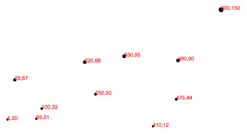
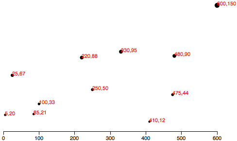
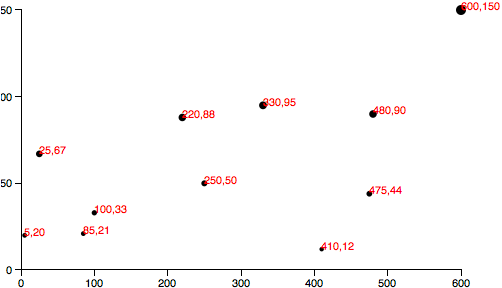
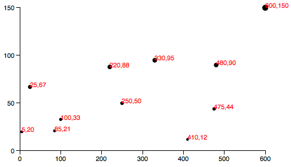
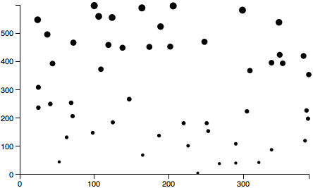

精通D3的尺度之后，我们得到了如下散点图。

现在，我们要给它加上水平和垂直的坐标轴，以便摆脱那些讨厌的红色标签数字，让图表更清晰一点。

## 坐标轴介绍
与尺度函数很类似，D3的坐标轴实际上也是函数，它的参数是用户定义的。不同的是，调用坐标轴函数之后，它并没有返回一个值，而是得到一个坐标轴的图形元素，包括线，标签和刻度。

注意，坐标轴函数是SVG专有的，因为它们生成的是SVG的元素。另外，坐标轴用于定量的尺度(相对于顺序(ordinal)尺度)

## 设置坐标轴
使用`d3.svg.axis()`方法可以生成一个一般的坐标轴函数:

var xAxis = d3.svg.axis();


坐标轴函数在使用前至少要指定一个尺度函数，这里，我们将`xScale`传递给坐标轴函数


xAxis.scale(xScale);


我们还可以指定坐标轴标签相对于坐标轴的位置。默认是`bottom`，表示标签会显示在坐标轴的下面(虽然这是默认的，显式指出来也没什么坏处)。

xAxis.orient("bottom");


当然，我们可以写出更简洁的代码，将这些设置合为一句。

var xAxis = d3.svg.axis()
                  .scale(xScale)
                  .orient("bottom");


最后，为了真正地生成坐标轴，并将其插入到SVG中(包括上面的线和标签)，我们必须执行这个`xAxis`函数。我会将这句代码置于脚本的最后，在其它元素之后生成坐标轴，这样坐标轴才不至于被其它元素所覆盖。

svg.append("g")
    .call(xAxis);


D3的`call()`函数接受一个和坂作为输入，然后，将此选择传递给任意函数。所以，在本例中，我们添加一个新的组元素`g`，它用来包含将要生成的所有坐标轴元素。(`g`并不是必须的，这里只不过用它来组织元素，以便我们对组中所有元素应用同一个`axis`类(class)，马上你就会看到了)

`g`成为方法链中下一个链接的选择，`call()`方法将此选择传递给`xAxis`函数，从而让我们的坐标轴在`g`中生成。上面的几句代码完全等价于下面的代码，只不过分开写显得更整洁和优美。


svg.append("g")
    .call(d3.svg.axis()
				.scale(xScale)
                .orient("bottom"));


虽然，你可以用将整个坐标轴函数塞到`call()`中，但是，我们还是更习惯于先定义函数，随后再执行。不管用哪种方式，[结果](htmls/160-axes-1.html)都是一样的。

## 清理
技术上看，这已经是一个实实在在的坐标轴了，只是它既不美观也无用处。为了清理地更整洁，我们需要为`g`元素设置一个`axis`类(class)，这需要用到CSS。


svg.append("g")
    .attr("class", "axis")  //Assign "axis" class
    .call(xAxis);

然后，我们需要定义相应的CSS样式，并置于网页的`<head>`中。


.axis path,
.axis line {
    fill: none;
    stroke: black;
    shape-rendering: crispEdges;
}

.axis text {
    font-family: sans-serif;
    font-size: 11px;
}


其中的[`shape-rendering`属性](https://developer.mozilla.org/en/SVG/Attribute/shape-rendering)是一个SVG属性，作用是让坐标轴和刻度线边缘更整齐，因而显得更清晰。

看起来好多了，只不过顶部的坐标轴被裁掉了，而且，我们还希望x轴位于图像的底部。这可以用`transform`来变换整个坐标轴组，将其推到底部。

svg.append("g")
    .attr("class", "axis")
    .attr("transform", "translate(0," + (h - padding) + ")")
    .call(xAxis);


注意`(h-padding)`的使用，使得整个组的顶部(原坐标系中y坐标为0)变成了`h`(图像高度)减去之前定义的`padding`值。

好多了！[这里](htmls/160-axes-2.html)是测试页面。

## 检查刻度

有些虱子(tick)传播疾病，而D3的刻度(tick)传播的是信息。不过，刻度过多也不一定是好事，多到一定程度之后会显得混乱不堪。你会发现，我们还从未有指定过在坐标轴上画多个少刻度，也没有指定刻度之间的间距是多少。若没有明确的指令，D3会像变魔术一样，通过分析`xScale`尺度函数来自动判断需要多少个刻度，以及使用哪些间距是合适的(本例中是50)。

正如你所想，你可以定制坐标轴的方方面面。比如通过`ticks()`方法，你可以设置刻度的大致个数。


var xAxis = d3.svg.axis()
                  .scale(xScale)
                  .orient("bottom")
                  .ticks(5);  //Set rough # of ticks


[这里](htmls/160-axes-3.html)是代码页面。

你大概已经发现，虽然我们指定的是5个刻度，但是D3居然替你作主，私自改成了7个。这是因为，D3在为你断后，它发现只用5个刻度，输入范围划分处只是些意义不大的值，这里是0,150,300,450和600。D3眼里，`ticks()`只不过是一个建议，为了最整洁和最具可读性，它会毫不犹豫地推翻你的建议。这本例中，最终的间距是100，即使这样会使得刻度数稍微多或稍微少一些，也再所不惜。这实际上是一种非常绝妙地功能，可以提高你设计时的可扩展性；随着数据集的变化，输入范围会扩大或缩小(数字更大或更小)，D3可保证刻度标签始终是整洁和易读的。

## 要不要Y轴?

//Define Y axis
var yAxis = d3.svg.axis()
                  .scale(yScale)
                  .orient("left")
                  .ticks(5);


//Create Y axis
svg.append("g")
    .attr("class", "axis")
    .attr("transform", "translate(" + padding + ",0)")
    .call(yAxis);



var padding = 30;


## 最后结果

//Dynamic, random dataset
var dataset = [];
var numDataPoints = 50;
var xRange = Math.random() * 1000;
var yRange = Math.random() * 1000;
for (var i = 0; i < numDataPoints; i++) {
    var newNumber1 = Math.round(Math.random() * xRange);
    var newNumber2 = Math.round(Math.random() * yRange);
    dataset.push([newNumber1, newNumber2]);
}


## 坐标轴刻度标签的格式化


var formatAsPercentage = d3.format(".1%");



xAxis.tickFormat(formatAsPercentage);


